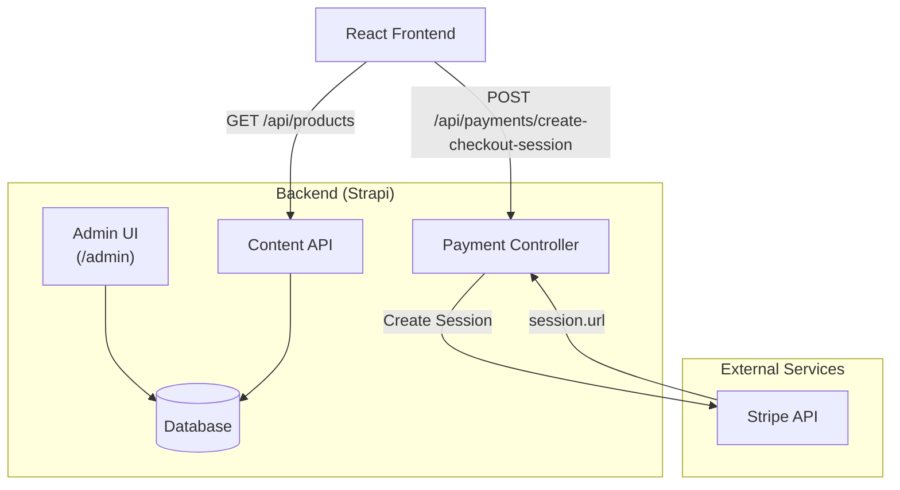

# Architecture & Tech Stack

## Architecture Overview

The backend is a **Strapi v5 Headless CMS** that serves as the data layer and API gateway for the frontend. It manages product content and handles payment processing via Stripe.

## Tech Stack

| Technology | Version | Purpose |
|------------|---------|---------|
| Strapi | 5.34.0 | Headless CMS framework |
| Node.js | >=20.0.0 | Runtime |
| TypeScript | ^5 | Type safety |
| PostgreSQL | - | Production database (Render) |
| SQLite | - | Local development database |
| Stripe | ^17.4.0 | Payment processing |
